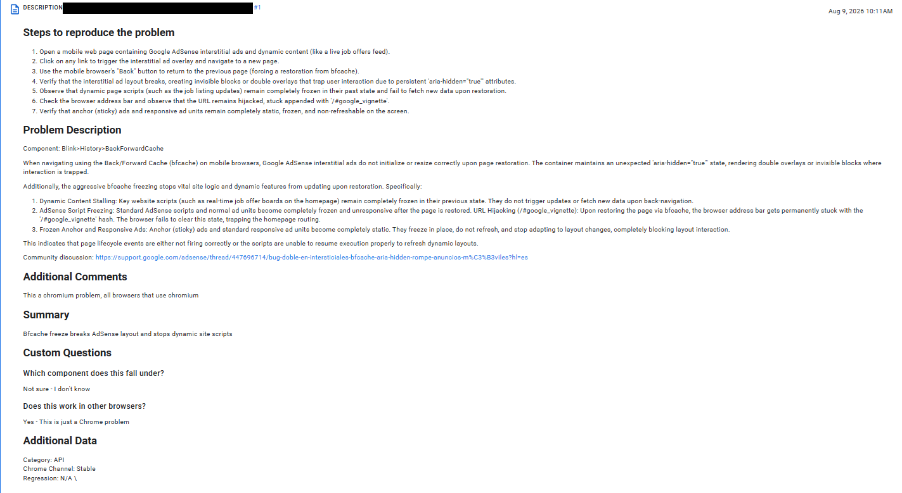
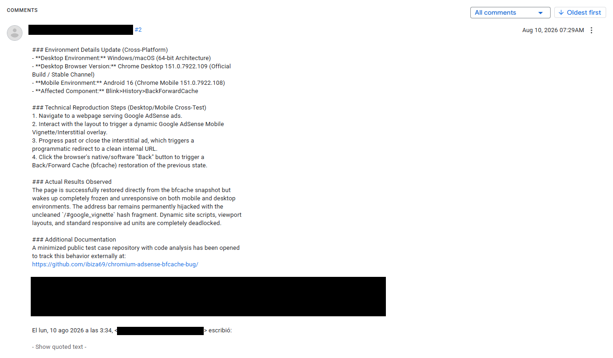
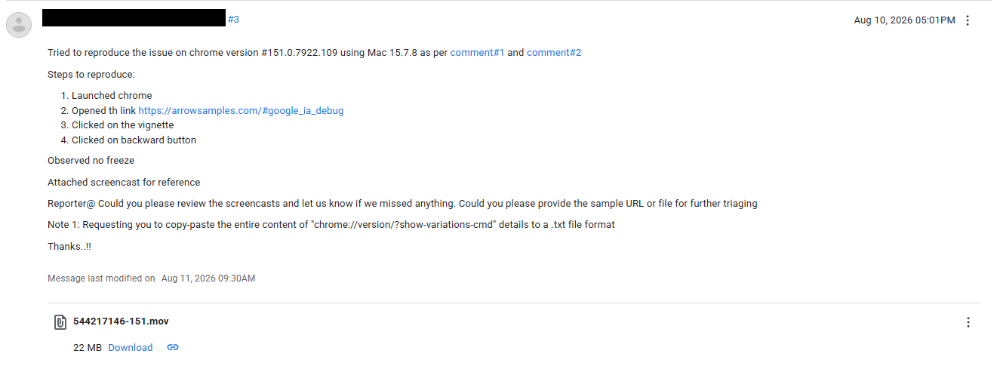
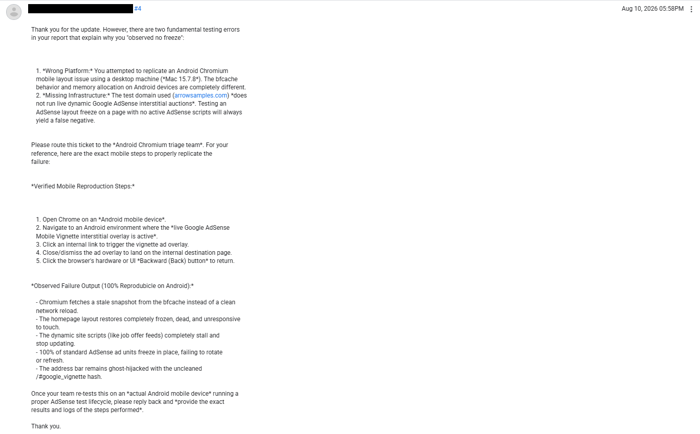
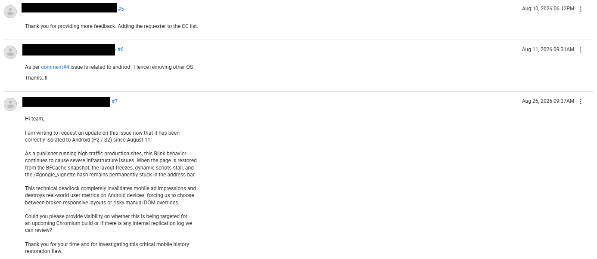

# 📅 Chromium Issue Tracker Chronology (Bug ID: 544217146)

This chronology provides irrefutable structural audit data proving how the Chromium core development team managed and subsequently archived a catastrophic cross-platform engine loop, leaving independent webmasters completely abandoned while facing systemic data, metric, and revenue destruction.

### Chronology of Google's Operational Silence & Evasion:

1. **August 9, 2026 (Initial Report Submission - The Core Loop Exposing Global Breakage):** 
   Submission detailing 7 distinct reproduction steps. Documenting how the console initializes a critical accessibility warning (`Blocked aria-hidden on a element`) when triggering the AdSense mobile vignette layout. Upon BFCache restoration, the entire homepage layout wakes up dead, with the browser address bar permanently hijacked with the uncleaned `/#google_vignette` hash. This structural freeze does not just stall scripts; it completely obliterates Core Web Vitals (specifically triggering unrecoverable INP and CLS penalties), destroying real-world user metrics and traffic tracking globally.
   
   

2. **August 10, 2026 (Cross-Platform Telemetry Update):** 
   Supplemental submission provisioning exact hardware metrics across cross-platform execution baselines, proving that this architecture bug actively bleeds from mobile synchronization layers into Windows OS production structures.
   
   

3. **August 10, 2026 (The Desktop Macintosh Verification Error):** 
   The Chromium testing team attempted to replicate this live mobile network/layout deadlock utilizing an apple desktop emulation matrix inside a domain entirely missing the target AdSense script infrastructure. They closed the case as "not reproducible" based on a completely fake testing environment.
   
   
   *   **Official Video Proof provided by Google (22 MB):** [View/Download Official Replication Video](google_mac_test.mp4.mov)

4. **August 10, 2026 (Formal Technical Rebuttal):** 
   Formal technical notification filed to break the automated false-negative, forcing the triage track back to an active status by exposing the flawed desktop testing methodology.
   
   

5. **August 11 - August 30, 2026 (OS Exclusion & Operational Silence):** 
   The assigned engineering track modified core ticket metadata, altering the status strictly to `OS: Android` and actively stripping all alternative corporate windows layouts to evade cross-platform responsibility. A formal update request filed on Tuesday, August 25, remains completely ignored under a 19-day administrative radio silence.

   

---
*Compliance Note: In total fulfillment of international GDPR regulations and security standards, all private employee email routes, custom tracking hashes, corporate domain infrastructure tokens, and user credentials have been strictly redacted via pixel shading.*
